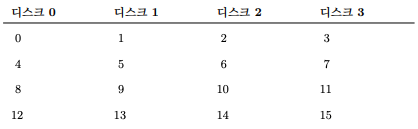
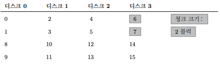
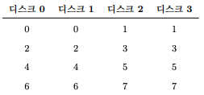
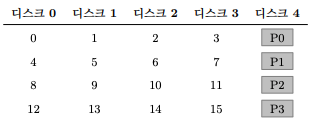
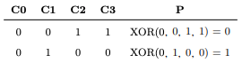
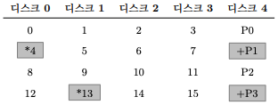
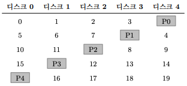

# 1. Redundant Array of Inexpensive Disk(RAID)
- 직역하면 경제적인 Disk의 이중화 배열이다.
- 디스크를 사용할 때 디스크가 좀 더 빨랐으면 하는 바램이 있다. I/O 작업은 느려서 전체 시스템의 병목이 되기 때문이다.

 
- RAID 기술은 여러 개의 디스크를 조화롭게 사용하여 고속이면서 대용량의 신뢰할 수 있는 디스크 시스템을 만든다.
- RAID는 여러 개의 디스크와 메모리, 시스템을 관리하기 위한 하나 또는 그 이상의 프로세서로 이루어진 복잡한 기계이다.
- RAID의 하드웨어는 컴퓨터 시스템과 매우 유사하며 디스크의 그룹을 관리하기 위한 전용 시스템이다.
- RAID의 장점
    - 성능이다. 디스크 여러 개를 병렬적으로 사용하면 I/O 시간이 크게 개선된다.
    - 용량이다.
    - 신뢰성을 높일 수 있다. <strong>데이터 중복 기술(redundancy)</strong>을 사용함으로써 RAID는 디스크 한 개의 고장은 감내할 수 있다.
    - RAID는 이러한 장점을 <strong>투명하게</strong> 제공하여 <strong>확산력(deploy ability)</strong>을 크게 개선하였으며 사용자와 관리자가 소프트웨어 호환성을 전혀 걱정하지 않고 사용할 수 있게 되었다.

## 1.1 인터페이스와 RAID의 내부
- 상위에 존재하는 파일 시스템에게 RAID는 크고 빠르고, 신뢰할 수 있는 디스크로 보인다.
- RAID도 선형적인 블럭들의 배열로 보이며 파일 시스템이 각 블럭을 읽거나 쓸 수 있다.
- 파일 시스템이 RAID에 논리적 I/O를 요청하면 RAID는 내부에서 어떤 디스크를 저급해야 요청을 완료할 수 있는지 계산한 후에 하나 또는 그 이상의 물리적 I/O를 발생시킨다.

 
- RAID 시스템은 보통 별도의 하드웨어 박스 형태로 되어 있으며 호스트와 SCSI나 SATA와 같은 표준 인터페이스로 연결된다.
- 내부적으로 RAID는 꽤 복잡한데, RAID의 작업을 지시하는 펌웨어를 실행하는 마이크로 컨트롤러 그리고 블럭을 읽고 쓸 때 버퍼로 사용할 DRAM과 같은 휘발성 메모리가 있으며, 어떤 경우에는 쓰기를 안전하게 버퍼링하기
위한 비휘발성 메모리뿐 아니라 패리티 계산을 위한 전용 논리 회로를 갖고 있기도 하다.
- 상위 레벨의 관점에서 RAID는 특수한 컴퓨터 시스템이다.

## 1.2 RAID의 평가 방법
- RAID를 구성하는 방법이 몇가지 있다.
- 세 개의 축을 중심으로 각 RAID 설계를 평가할 것이다.
    1. 용량
    2. 신뢰성
    3. 성능
- RAID 레벨 0(스트라이핑), 레벨 1(미러링), 레벨 4/5(패리티에 기반을 둔 중복 저장)을 다뤄보겠다.

## 1.3 RAID 레벨 0: 스트라이핑
- RAID 레벨은 사실 중복 저장을 하지 않기 때문에 RAID 레벨이 아니다.
- RAID 레벨 0 또는 <strong>스트라이핑(striping)</strong>이라고 더 잘 알려진 이 방식은 성능과 용량에 대해 훌륭한 상한 기준을 나타낸다.
- 스트라이핑은 위의 그림과 같이 블럭들을 여러 디스크에 걸쳐서 줄을 긋는 것처럼 저장한다.

- 위의 그림은 단순한 스트라이핑

- 위의 그림은 더 큰 청크 크기 단위로 스트라이핑(청크 크기: 2 블럭)

### 청크 크기
- 작은 청크 크기가 의미하는 것은 많은 파일들이 여러 디스크에 걸쳐서 스트라이프된다는 말이며 그 결과로 하나의 파일을 읽고 쓰는 데 병렬성이 증가하게 된다.
    - 하지만, 블럭의 위치를 여러 디스크에서 찾아야 하므로 위치 찾기 시간이 늘어난다.
- 큰 청크 크기의 경우에는 파일 내의 병렬성은 줄어들고 따라서 높은 처리 성능을 얻으려면 여러 요청을 병행하게 실행해야 한다.
    - 하지만 큰 청크 크기의 경우 위치 찾기 시간을 줄어든다.
    
### RAID-0 평가하기
- 성능은 준수하다.
- 용량은 매우 좋다.
- 신뢰성은 떨어진다.
    - 복구할 수 있는 디스크가 없기 때문에
    
## 1.4 RAID 레벨 1: 미러링
- RAID 레벨 1 또는 미러링으로 알려져 있다.
- 미러링을 사용하는 시스템에서는 각 블럭에 대해서 하나 이상의 사본을 둔다.
- 각 사본은 당연히 서로 다른 디스크에 저장된다.

- 위의 그림은 단순한 미러링이다.

- 미러링된 배열에서 블럭을 읽을 때 RAID는 원본을 읽을 건지 사본을 읽은건지 선택할 수 있따.
- 반면에 블럭을 쓰는 경우에는 그렇게 선택할 수 없다.
    - RAID는 신뢰성을 유지하기 위해서 두 벌의 데이터를 모두 갱신해야 한다.
    - 이러한 쓰기 요청은 병렬적으로 처리될 수 있댜ㅏ.
    
### RAID-1 분석
- 용량 측면에서는 RAID-1은 비용이 많이든다. 미러링 레벨이 2라면 최대 사용 가능한 용량의 반만 사용할 수 있다.
- 신뢰성 측면에서는 괜찮은 편이다. 디스크 중 어느 것에서 고장이 발생하여도 감내할 수 있다.
- 속도는 평균적으로 하나의 디스크에 쓰는 시간보다는 조금 더 길다.
- 랜덤 읽기가 미러링된 RAID에서는 최고의 워크로드이다.

## 1.5 RAID 레벨 4: 패리티를 이용한 공간 절약
- 패리티 기반의 접근 방법은 저장 공간을 더 적게 사용하려고 하여 미러링 기반시스템이 지불하는 엄청난 공간 낭비를 극복하려고 시도한다.
    - 그 대신 성능이라는 비용을 지불해야 한다.
    

- 위의 그림은 패리티가 있는 RAID-4 이다.
    - 각 데이터 스트라이프마다 해당 스트라이프에 대한 중복 정보를 담고 있는 <strong>패리티</strong> 블럭 하나를 추가한다.

- 위의 그림은 패리티 계산법이다.
    - 어떤 줄이던 그 줄의 1의 수는 패리티 비트를 포함해서 짝수가 되어야 한다.
    - 이것은 RAID의 패리티가 정확하게 동작하기 위해서 반드시 유지해야 하는 <strong>불변량</strong>이다.

### RAID-4 분석
- 용량 측면에서는 패리티 정보의 저장을 위해 각 디스크 그룹에 속한 디스크 하나를 사용하기 때문에 (N-1)*B의 저장 공간을 제공한다.
- 신뢰성 측면에서 RAID-4는 오직 하나만의 디스크 고장을 감내할 수 있다.
- 성능은 패리티 디스크를 제외한 모든 디스크를 활용할 수 있다.

- 위의 그림 처럼 패리티 디스크에서 쓰기는 패리티 디스크로 인해서 병목 현상이 발생한다.
    - 이 경우를 패리티 기반 RAID의 <strong>samll-write 문제</strong>라고 부른다.
    - 데이터 디스크들에 대한 입출력은 서로 병렬적으로 실행하는 것이 가능하나 쓰기는 순차적으로 처리된다.

## 1.6 RAID 레벨 5: 순환 패리티
- Small write 문제를 해결하기 위해서 RAID-5의 개념이 등장하였다.
- RAID-5는 RAID-4와 거의 동일하게 동작하지만 패리티 블럭을 <strong>순환(rotate)</strong> 시킨다는 점이 다르다.

- 위의 그림은 순환하는 패리티를 사용하는 RAID-5이다.

### RAID-5 분석
- 랜덤 쓰기 성능은 요청들을 병렬적으로 처리할 수 있기 때문에 RAID-4 대비 눈에 띄게 개선된다.

## 1.7 RAID 비교: 정리

- 결론적으로 성능만을 원하고 신뢰성을 고려하지 않는다면 스트라이핑이 최고이다.
- 만약 랜덤 I/O의 성능과 신뢰성을 원한다면, 미러링이 최선이다. 하지만 용량을 손해본다.
- 만약 용량과 신뢰성이 목적이라면, RAID-5가 승자이다. small write 성능에 대한 비용만 지불하면 된다.

## 1.8 요약
- RAID는 여러 개의 독립적인 디스크를 대용량의, 더 신뢰성 있는 하나의 개체로 변형시킨다.
- 투명하게 위의 일을 하기 때문에 상위 계층의 하드웨어와 소프트웨어는 변형 사실에 대해 인지하지 못한다.

