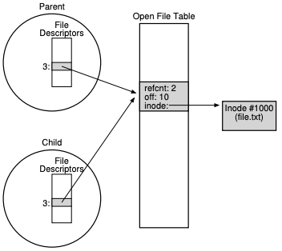

# 1. 파일과 디렉터리
- 지금까지 운영체제를 구성하는 두 개의 핵심 개념을 살펴보았다.
    - CPU를 가상화한 "프로세스"와 메모리를 가상화한 "주소 공간"이다.
    - 이 개념들은 서로 협력하여 응용 프로그램들이 서로 독립된 세계에서 실행될 수 있도록 한다.
    - 자신만의 프로세서와 자신만의 메모리가 있는 것처럼 만들어 준다.
- 이번 장에서는 <strong>영속 저장 장치(persistent storage)</strong>라고 하는 가상화에 있어서 또 하나의 핵심적인 개념을 다룬다.
    - <strong>하드 디스크 드라이브</strong> 또는 좀 더 최근의 <strong>솔리드스테이트 드라이브(Solid-state storage, SSD)</strong>와 같은 저장 장치는 영구적으로 정보를 저장한다.
- 어떻게 영속 장치를 관리하는가
    - 운영체제가 영속 장치를 어떻게 관리해야 할까?
    - API들은 어떤 것이 있는가?
    - 구현의 중요한 측면은 무엇인가?
- 영속 데이터를 관리하는 핵심 기술들을 살펴볼 것이며 성능과 신뢰성을 향상시키는 기법들을 중점으로 알아보자

## 1.1 파일과 디렉터리
저장 장치의 가상화에 대한 두 가지 주요 개념이 개발되었다.

1. <strong>파일</strong>
    - 파일은 단순히 읽거나 쓸 수 있는 순차적인 바이트의 배열이다.
    - 각 파일은 <strong>저수준 이름(low-level name)</strong>을 가지고 있으며 보통은 숫자로 표현되지만 사용자는 그 이름에 대해서 알지 못한다.
    - 이 저수준의 이름을 <strong>아이노드 번호(inode number)</strong>라고 부른다.
    - 각 파일은 아이노드 번호와 연결되어 있다.
    - 시스템에서 운영체제는 파일의 구조를 모른다. 파일 시스템의 역할은 그러한 데이터를 디스크에 안전히 저장하고, 데이터가 요청되면 처음 저장했떤 데이터를 돌려주는 것이다.
2. <strong>디렉터리</strong>
    - 파일과 마찬가지로 디렉터리도 저수준의 이름(아이노드 번호)을 갖는다.
    - 파일과는 달리 내용은 구체적으로 정해져 있다.
    - 디렉터리는 <사용자가 읽을 수 있는 이름, 저수준의 이름> 쌍으로 이루어진 목록을 갖고 있다.
    - 디렉터리의 각 항목은 파일 또는 다른 디렉터리를 가리킨다.
    - 디렉터리 내에 다른 디렉터리를 포함함으로써 사용자는 모든 파일들과 디렉터리들이 저장되어 있는 임의의 <strong>디렉터리 트리(directory tree), 디렉터리 계층(directory hierarchy)</strong>을 구성할 수 있다.
    - 디렉터리의 계층은 <strong>루트 디렉터리(root directory)</strong>부터 시작하며 원하는 파일이나 디렉터리의 이름을 표현할 때 까지 <strong>구분자(separator)</strong>를 사용하여 <strong>하위 디렉터리</strong>를 명시할 수 있다.
    
## 1.2 공유하는 파일 테이블의 요소들: fork()와 dup()
> <strong>파일 디스크립터</strong>
> 
> 파일 디스크립터는 프로세스마다 존재하는 정수로서 Unix 시스템에서 파일을 접근하는 데 사용된다. 열린 파일을 읽고 쓰는 데도 사용된다. 해당 파일에 대한 권한을 갖고 있어야 한다.                     
> 파일 디스크립터를 파일 객체를 가리키는 포인터로 볼 수도 있다.

> <strong>자료구조 - open file table</strong>
> 
> 각 프로세스는 파일 디스크립터 배열을 갖고 있따. 각 파일 디스크립터는 시스템이 관리하는 <strong>열린 파일 테이블(open file table)</strong>의 요소를 가리킨다. 이 테이블의 각 요소는 디스크립터가
> 가리키는 파일과 현재 오프셋 그리고 읽기 쓰기 여부와 같은 다른 관련 정보를 담고 있다.

- 열린 파일 테이블의 요소와 파일 디스크립터를 연결하는 것은 일대일 매핑으로 이루어 진다.
    - 다른 프로세스가 같은 파일을 동시에 읽는다 하더라도 각 프로세스는 개별적인 열린 파일 테이블의 요소를 다룬다.
    - 같은 파일에 대한 논리적 읽기와 쓰기는 독립적이며 각각이 개별적인 현재 오프셋을 관리한다.
- 프로세스들이 열린 파일 테이블을 공유하는 경우가 있다.
    - 부모 프로세스가 fork()를 사용하여 자식 프로세스를 생성하는 경우이다.
    - dup() 시스템 호출을 사용하여 공유하는 경우이다.
        - dup()은 이미 열려 있는 파일의 디스크리벝를 참조하는 새로운 파일 디스크립터를 생성한다.
    

- 위의 그림은 열린 파일 테이블의 요소를 공유하는 프로세스들이다.
    - <strong>참조 횟수(reference count, Refcnt)</strong>을 활용한다. 파일 테이ㅡㅂㄹ의 요소가 공유되면 해당 참조 횟수가 증가된다. 두 프로세스가 모두 파일을 닫은 후에야 이 요소는 제거된다.

## 1.3 fsync()를 이용한 즉시 기록
- write() 호출의 목적은 대부분 해당 데이터를 가까운 미래에 영속 저장 장치에 기록해달라고 파일 시스템에게 요청하는 것이다.
    - 성능상 이유로 파일 시스템은 쓰기들을 일정시간 동안 메모리에 모은다(<strong>버퍼링</strong>).
- 어떤 프로그램은 쓰기에 있어서 좀 더 강력한 보장을 필요로 한다.
    - 예를들어 DBMS의 복원 모듈은 때때로 강제적으로 즉시 디스크에 기록할 수 있는 기능이 필요하다.
    - Unix에서 응용 프로그램에게 제공되는 인터페이스는 fsync다. 프로세스가 특정 파일 디스크립터에 대해서 fsync()를 호출하면 파일 시스템은 지정된 파일의 모든 <strong>더티</strong> 데이터를
    디스크로 강제로 내려보낸다.
    - 디렉터리를 함께 fsync() 함으로써, 파일 자체와 이 파일이 속한 디렉터리를 모두 디스크에 저장한다.
    
## 1.4 파일 정보 추출
- 파일에 대한 정보를 <strong>메타데이터(metadata)</strong>라고 부른다.

    struct stat {
        dev_t st_dev; /* 파일이 저장된 장치의 ID */
        ino_t st_ino; /* 아이노드 번호 */
        mode_t st_mode; /* 보호 */
        nlink_t st_nlink; /* 하드링크의 수 */
        uid_t st_uid; /* 소유자의 사용자 ID */
        gid_t st_gid; /* 소유자의 그룹 ID */
        dev_t st_rdev; /* 장치 ID (특수 파일인 경우) */
        off_t st_size; /* 총 크기, byte 단위 */
        blksize_t st_blksize; /* 파일 시스템 입출력의 블록 크기 */
        blkcnt_t st_blocks; /* 할당된 블럭의 수 */
        time_t st_atime; /* 최종 접근 시간 */
        time_t st_mtime; /* 최종 갱신 시간 */
        time_t st_ctime; /* 최종 상태 변경 시간 */
    };

  
## 1.5 파일 삭제
- unlicnk() 를 사용하여 파일을 삭제한다.
    - 이 부분에 대한 이해는 뒤에 이야기 한다.
    
## 1.5 디렉터리 생성
- 디렉터리 관련 시스템 콜들은 디렉터리를 생성하고, 읽고, 삭제한다.
    - 디렉터리에는 절대로 직접 쓸 수 없다.
    - 디렉터리는 파일 시스템의 메타데이터로 분류되며, 파일 시스템이 디렉터리의 무결성을 책임져야 한다.
- 디렉터리 생성을 위한 시스템 콜로 mkdir()이 있다.
- 처음 디렉터리가 생성되면 두 개의 항목이 존재한다.
    - 하나의 항목은 디렉터리 자신을 나타내기 위한것. "."(dot) 으로 표현.
    - 다른 항목은 자신의 부모 디렉터리를 가리키기 위한것. ".."(dot-dot) 으로 표현
    
## 1.6 디렉터리 읽기
- 디렉터리를 여는 것은 파일을 여는 것과는 다른 시스템 콜을 사용한다.
- opendir(), readdir() 및 closedir()를 사용한다.

## 1.7 디렉터리 삭제하기
- rmdir() 시스템 콜을 사용하여 디렉터리를 삭제할 수 있다.

## 1.8 하드 링크
> 파일 삭제 시 왜 unlink()를 사용하는지 이해해보자.

- 파일 시스템 트리에 항목을 추가하는 새로운 시스템 콜 link()를 알아보아야 한다.
- link() 시스템 콜은 두 개의 인자를 받는데, 하나는 원래의 경로명이고, 다른 하나는 새로운 경로명이다.
- 원래 파일 이름에 새로운 이름을 "link(연결)" 하면 동일한 파일을 접근할 수 있는 새로운 방법을 만들게 된다.


  
    prompt> echo hello > file
    prompt> cat file
    hello
    prompt> ln file file2
    prompt> cat file2
    hello

  
- 파일을 생성할 때 사실은 두 가지 작업을 하게 된다.
    - 하나는 파일 관련 거의 모든 정보를 관리하는 자료 구조(아이노드)를 만드는 것이다.
    - 파일 크기와 디스크 블럭의 위치 등이 포함된다.
    - 두번째는 해당 파일에 사람이 읽을 수 있는 이름을 연결하고 그 연결 정보를 디렉터리에 생성하는 것이다.
    

  
    prompt> ls -i file file2
    671508084
    671508084
    prompt>


- 파일 삭제 시 아래와 같이 unlink()를 호출한다.


  
    prompt> rm file 
    removed 'file'
    prompt> cat file2
    hello

 
- 파일을 unlink하면 아이노드 번호의 <strong>참조 횟수(reference count)</strong>를 검사한다.
    - 이 참조 횟수가 특정 아이노드에 대해 다른 이름이 몇 개나 연결되어 있는지 관리한다.
    - unlink()가 호출되면 이름과 해당 아이노드 번호 간의 "연결"을 끊고 참조 횟수를 하나 줄인다.
    - 참조 횟수가 0에 도달하면 파일 시스템은 비로소 아이노드와 관련된 데이터 블럭을 해제하여 파일을 진정으로 "삭제"한다.
    
## 1.9 심볼릭 링크
- <strong>심볼릭 링크(symbolic link)</strong>라 하고 때로는 <strong>소프트 링크(soft link)</strong>라고 부른다.
- 디렉터리에 대해서는 하드 링크를 만들 수 없으며(디렉터리 트리에 순환 구조를 만들 것을 우려하여), 다른 디스크 파티션에 있는 파일에 대해서도 하드 링크를 걸 수 없다(아이노드 번호는 하나의 파일 시스템 내에서만 유일하다)는 등의 제한이 있기 때문에 심볼릭 링크가 만들어졌다.
- 하드 링크와 유사하지만 소프트 링크는 사실 매우 다르다. 
    - 첫 번째 차이는 심볼릭 링크는 다른 형식의 독립된 파일이라는 것이다.
    - 심볼릭 링크는 파일 시스템에 존재하는 세 번째 종류의 유형이다.(파일과 디렉터리 그리고 심볼릭 링크)
- 심볼릭 링크는 연결하는 파일의 경로명을 저장한다.
- 심볼릭 링크는 <strong>dangling reference</strong>라는 문제가 발생할 수 있다.
    - 심볼릭 링크의 원래 파일을 삭제하면 심볼릭 링크가 가리키는 실제 파일은 더이상 존재하지 않기 때문에 심볼릭 링크된 파일도 조회할 수 없게된다.

> 심볼릭 링크는 윈도우의 "바로가기"를 생각하면 이해하기 쉽다!

## 1.10 권한 비트와 접근 제어 목록
- 실제로는 제한된 물리적인 자원을 경쟁하는 객체들이 안전하게 공유할 수 있도록 운영체제가 여러 기술들을 사용한다.
- 파일 시스템 역시 디스크에 대한 가상화를 제공한다.
    - 파일 시스템은 디스크 상의 블럭들을 좀 더 사용자 친화적인 개념인 파일과 디렉터리로 변환한다.
    - 파일은 일반적으로 다수의 사용자들과 다수의 프로세스들이 공유한다.
    - 파일 시스템은 공유범위를 한정하는 다양한 기법들을 제공한다.
- 첫 기법은 고전적인 Unix <strong>권한 비트(permission bits)</strong>이다.


    prompt> ls -l foo. txt
    -rw-r--r-- 1 honggoo kang 0 Aug 24 16:29 foo.txt

- 위의 -rw-r--r--이 권한 비트를 나타낸다.
    - 권한은 세 개의 그룹으로 나뉘어 있다.
        - 파일의 <strong>소유자(owner)</strong>, 해당 <strong>그룹(group)</strong>, 그리고 그 외의 나머지 사용자(<strong>other</strong>)이다.
    - 각 세개씩 세개의 그룹이 나눠 갖는다 총 9개의 비트
        - 세 개는 읽기, 쓰기 그리고 실행 가능한지를 나타낸다.
- <strong>파일 모드(file mode)</strong>를 변경하는 chmod 명령을 사용하면 이 파일의 소유자는 권한의 설정을 바꿀 수 있다.


    prompt> chmod 600 foo.txt
    rw-------

- 이 명령은 소유자의 읽기 비트(4)와 쓰기 비트(2)를 켜서 읽고 쓰기가 가능하도록 한다.

 
- AFS와 같은 분산 파일 시스템을 포함하는 다른 파일 시스템의 경우 좀 더 복잡한 제어 기능을 갖고 있다.
    - AFS는 디렉터리맏다 <strong>접근 제어 목록(access control list(ACL)</strong>을 갖고 있다.
    - 접근 제어 목록은 누가 특정 자원을 접근할 수 있는지를 좀 더 일반적이고 강력한 방법으로 표현한다.
    
# 1.11 파일 시스템 생성과 마운트
- 다수의 파일 시스템들이 존재할 때 이들을 묶어서 어떻게 하나의 큰 디렉터리 트리를 구성할까?
    - 여러 개의 파일 시스템 파티션들이 모여서 하나의 큰 디렉터리를 구성한다.
    - 각각의 파일 시스템을 생성하고, 이들을 "마운트" 함으로써 단일 디렉터리 트리를 구성한다.
- 새로이 생성된 파일 시스템을 루트 디렉터리에서 시작하는 기존의 디렉터리 구성을 통해 접근할 수 있또록 해주어야 한다.
    - 이 작업을 마운트라고 한다.
- 기존의 디렉터리 중 하나를 <strong>마운트 지점(mount point)</strong>으로 지정한다.
    - 그리고 나서 마운트 지점에 생성된 파일 시스템을 "붙여 넣는다".
- 여러 개의 개별적인 파일 시스템을 갖는 대신에 마운트는 모든 파일 시스템들을 하나의 트리 아래에 통합시킨다.