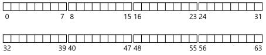
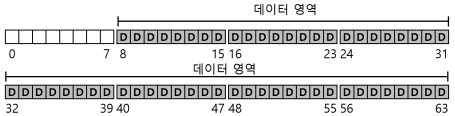
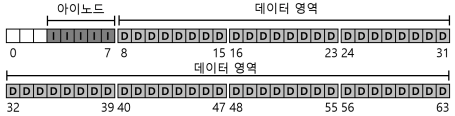
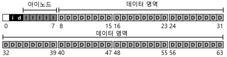
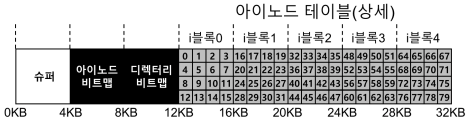
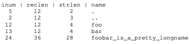
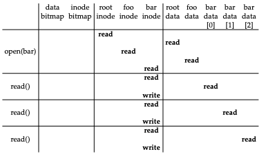
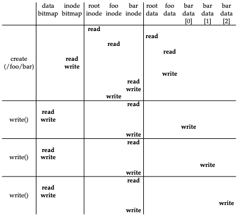

# 1. 파일 시스템 구현
- <strong>vsfs(Very Simple File System)</strong>은 Unix 파일 시스템을 단순화한 것으로 디스크 자료구조(on-disk structure)와 접근 방법 그리고 다양한 파일 시스텤들의 정책들을 소개하기 위한 용도이다.
- 파일 시스템은 순수한 소프트웨어이다.
- 어떻게 간단한 파일 시스템을 만들 것인가
    - 간단한 파일 시스템을 어떻게 만들 수 있을까?
    - 디스크 위에는 어떤 자료 구조가 필요할까?
    - 그러한 자료 구조는 어떤 정보를 추적해야 하는가?
    - 그 자료 구조들은 어떻게 접근되어야 하는가?

# 1.1 생각하는 방법
- 파일 시스템에 대해 학습할 때, 두 가지 측면에서 접근해야 한다.
    1. 파일 시스템의 <strong>자료 구조</strong>
        - 파일 시스템이 자신의 데이터와 메타데이터를 관리하기 위해 디스크 상에 어떤 종류의 자료 구조가 있어야 하겠는가?
    2. <strong>접근 방법(access method)</strong>
        - 프로세스가 호출하는 open(), read(), write() 등의 명령들은 파일 시스템의 자료 구조와 어떤 관련이 있는가?
        - 특정 시스템 콜을 실행할 때에 어떤 자료 구조들이 읽히는가?
        - 이 모든 과정이 얼마나 효율적으로 동작하는가?
    
# 1.2 전체 구성
- 가장 먼저 해야 할 것은 디스크를 <strong>블럭(block)</strong>들로 나누는 것이다.

- 파일 시스템의 대부분의 공간은 사용자 데이터로 이루어져 있다.
- 사용자 데이터가 있는 디스크 공간을 <strong>데이터 영역(data region)</strong>이라고 하자.

- 파일 시스템은 각 파일에 대한 정보를 관리한다.
- 그 정보가 <strong>메타데이터(metadata)</strong>의 핵심이다.
- 파일을 구성하는 데이터 블럭(데이터 영역 내의)들과 그 파일의 크기, 소유자, 접근 권한, 접근과 변경 시간 등과 같은 정보들이 이에 해당한다.
- 파일 시스템은 이 정보를 보통 <strong>아이노드(inode)</strong>라고 부르는 자료 구조에 저장한다.
- 아이노드들의 저장을 위해 디스크 공간이 필요하다.
    - 이 영역을 <strong>아이노드 테이블(inode table)</strong>이라 한다.
    

- 꼭 필요한 정보는 아이노드나 데이터 블럭의 사용여부에 대한 것이다.
    - 각 블럭이 현재 사용 중인지 아닌지를 표현할 <strong>할당 구조(allocation structure)</strong>가 필요하다.
    - 예를 들면 <strong>프리 리스트(free list)</strong>를 사용하여, 사용 중이 아닌 블럭들을 링크드 리스트 형태로 관리할 수 있다.
    - 아이노드 첫 번째 프리 블럭의 위치만 기억하면 된다.
    - 우리는 단순한 <strong>비트맵(bitmap)</strong>을 사용한다.
- 데이터 영역에 있는 블럭들의 사용여부를 표현하기 위해서 <strong>데이터 비트맵(data bitmap)</strong>을, 아이노드 테이블에 있는 아이노드들이 사용 중인지를 나타내기 위해서 <strong>아이노드 비트맵(inode bitmap)</strong>을 사용한다.
    - 비트맵은 비트들의 배열이다.

- 남은 한 블럭의 존재는 <strong>슈퍼블럭(super block)</strong>을 위한 공간이다.
    - 슈퍼블럭은 이 파일 시스템 전체에 대한 정보를 담고 있다.
    - 예를 들면 파일 시스템에 몇 개의 아이노드와 데이터 블럭이 있는지, 아이노드 테이블은 어디에서 시작하는지 같은 정보를 담고 있다.
    - 일반적으로 대부분의 파일 시스템은 슈퍼블럭을 몇 개 복사 해둔다.
- 파일 시스템을 마운트할 때, 운영체제는 우선 슈퍼블럭을 읽어들여서 파일 시스템의 여러가지 요소들을 초기화하고, 그 후에 각 파티션을 파일 시스템 트리에 붙히는 작업을 진행한다.

## 1.3 파일 구성: 아이노드
- 파일 시스템의 디스크 자료 구조 중 가장 중요한 것은 <strong>아이노드(inode)</strong>이다.
- 아이노드는 <strong>인덱스 노드(index node)</strong>의 줄임말이다.
- 이 노드들은 원래는 배열로 되어 있었는데, 각 배열은 특정 아이노드를 접근하기 위해 탐색된다.
- <strong>아이노드</strong>
    - 이 자료 구조는 파일 크기, 접근권한 그리고 파일 블럭들의 위치 정보를 가지고 있다.
- 각 아이노드는 숫자(<strong>아이-넘버(i-number)</strong>)로 표현된다.

- 아이노드에는 파일에 대한 정보가 다 들어있다.
    - 파일의 종류(예, 일반 파일, 디렉터리 등), 크기, 할당된 블럭 수, 보호 정보(파일의 소유, 접근 권한 등), 시간 정보와 더불어 데이터 블럭이 디스크 어디에 존재하는지(예, 포인터의 일종)와 같은 정보들이 담겨 있다.
    - 이와 같은 정보들을 <strong>메타데이터(metadata)</strong>라고 한다.
- 아이노드를 설계 시 가장 중요한 결정 중 하나는 데이터 블럭의 위치를 표현하는 방법이다.
    - 간단한 방법은 아이노드 내에 여러 개의 <strong>직접 포인터(direct pointer, 디스크 주소)</strong>를 두는 것이다.
    - 각 포인터는 파일의 디스크 블럭 하나를 기리킨다.
    - 이 방법에는 파일 크기의 제한이 있다. 파일 크기는 (포인터의 개수)*(블럭 크기)

### 멀티 레벨 인덱스
- 큰 파일을 지원하기 위해서 파일 시스템 개발자들은 아이노드 내에 다른 자료 구조를 추가해야 했다.
- 일반적으로 사용되는 방법 중 하나는 <strong>간접 포인터(indirect pointer)</strong>라는 특수한 포인터를 사용하는 것이다.
- 간접 포인터는 데이터 블럭을 가리키지 않는다. 
- 간접 포인터가 가리키는 블럭에는 데이터 블럭을 가리키는 포인터들이 저장된다.

- 더 큰 파일을 저장하고 싶을 땐 <strong>이중 간접 포인터(double indirect pointer)</strong>를 추가한다.
    - 이중 간접 포인터가 가르키는 블럭에는 간접 포인터들이 저장되어 있다.
    - 더 큰 파일을 저장하고 싶다면 <strong>삼중 간접 포인터(triple indirect pointer)</strong>를 사용하면 된다.
- 디스크 블럭들은 일종의 트리 형태로 구성되어 하나의 파일을 이룬다. 이러한 구성방식을 <strong>멀티 레벨 인덱스</strong> 기법이라 한다.

> 위의 방식의 트리는 형태가 매우 편향적이다. 파일의 시작 부분을 이루는 블럭들은 한번의 포인터로 접근이 가능하다. 큰 파일의 경우, 파일의 끝부분에 있는 블럭들은 포인터를
> 세 번 따라가야 실제 블럭을 읽을 수 있다. 왜 이렇게 했을까? <strong>대부분의 크기가 작기</strong> 때문이다. 대부분의 파일들이 작다면, 작은 파일을 빨리 읽고 쓸 수 있도록 파일 구조를 설계 해야한다.

## 1.4 디렉터리 구조
- 디렉터리는 (항목의 이름, 아이노드 번호) 쌍의 배열로 구성되어 있다.

- 위의 표는 dir의 데이터 블럭이다.
    - 항목의 길이를 명시하는 이유 중에 하나가 중간에 빈 공간이 생기기 때문이다. 새로운 디렉터리 항목을 생성할 때, 기존 항목이 삭제되어 생긴 빈 공간에 새로이 생성된 항목을 위치시킬 수도 있기 때문이다.
- 대부분 파일 시스템에서 디렉터리는 특수한 종류의 파일로 간주한다.
    - 디렉터리는 자신의 아이노드를 가지며, 이 아이노드는 아이노드 테이블에 존재한다.(아이노드의 type 필드에 "일반 파일" 대신에 "디렉터리"라고 명시되어 있다).
    - 디렉터리는 자신의 데이터 블럭을 갖고 있으며, 이들 블럭의 위치는 일반 파일과 마찬가지로 아이노드에 명시되어 있다.
- 파일 생성 시 현재 디렉터리에 동일한 이름의 파일이 있는지를 먼저 검사해야 한다.

## 1.5 빈 공간의 관리
- <strong>빈 공간 관리(free space management)</strong>는 모든 파일 시스템에서 중요하다. 
- 파일 생성 시 아이노드를 할당해야 한다. 
    - 파일 시스템은 아이노드 비트맵을 탐색하여 비어 있는 아이노드를 찾아 파일에 할당한다.
    - 파일 시스템은 해당 아이노드를 사용 중으로 표기하고(1로 표기) 디스크 비트맵도 적절히 갱신한다.
- 할당 시 가능하면 여러 개의 블럭들이 연속적으로 비어 있는 공간(예, 여덟개)을 찾아서 할당한다.
    - 추후에 할당요청이 발생하면 기존에 할당된 공간에 이어서 블럭을 할당하기 위해서이다.
    - 이러한 <strong>선할당(pre-allocation)</strong> 정책은 데이터 블럭 할당 시 자주 사용된다.
    
## 1.6 실행 흐름: 읽기와 쓰기
- <strong>실행 과정(access path)</strong>을 이해하는 것은 파일 시스템 동작을 완전히 이해하는 매우 중요한 두 번째 요인이다.

### 디스크에서 파일 읽기

1. root i-number 는 파일 시스템이 마운트될 때 값이 결정된다.
2. 파일 시스템은 읽어들인 아이노드에서 데이터 블럭의 포인터를 추출한다.
    - 포인터가 가리키는 블럭에는 루트 디렉터리의 내용이 들어 있따.
    - 파일 시스템은 이 포인터들을 사용하여 디렉터리 정보를 읽고, foo라는 항목을 찾는다.
3. foo 파일의 디렉터리 항목을 찾아서, foo의 아이노드 번호를 파악한다. 
4. foo의 아이노드가 있는 블럭과 그에 대한 디렉터리 데이터를 읽은 후에 bar에 대한 아이노드 번호를 찾아낸다.
5. 마지막 단계의 open()은 bar에 대한 아이노드를 메모리로 읽어 들인다. 
    - 파일 시스템은 최종적으로 해당 파일에 대한 접근 권한을 확인하고, 이프로세스의 open file-table에서 파일 디스크립터를 할당받아 사용자에게 리턴한다.
6. open() 이후에는, read() 시스템 콜을 통해 파일을 읽는다.

### 디스크에 파일 쓰기

- 읽기와 비슷한 과정을 밟는다.
    - 먼저 파일을 열고 응용 프로그램은 write()를 호출하여 새로운 내용으로 파일을 갱신하고 파일을 닫는다.
- 읽기와는 다르게 파일 쓰기는 블럭 <strong>할당</strong>을 필요로 할 수 있다.
    - 새로운 파일에 쓸 때에는 각 write()는 데이터를 디스크에 기록해야 할 뿐만 아니라 파일에 어느 블럭을 할당할지를 결정해야 하며 그에 따라 디스크에 다른 자료 구조들을 갱신해야 한다(예, 데이터 비트맵과 아이노드)

## 1.7 캐싱과 버퍼링
- 파일을 읽고 쓰는 것은 많은 I/O를 발생시킨다.
    - 컴퓨터의 전체 성능에 중요한 영향을 미친다. 
    - 성능 개선을 위해 대부분의 파일 시스템들은 자주 사용되는 블럭들을 메모리(DRAM)에 캐싱한다.
- 초기의 파일 시스템에서는 자주 사용되는 블럭들을 저장하기 위해서 캐시를 도입하였다.
    - <strong>LRU</strong>와 기타 다른 캐시 교체 정책들인 <strong>고정 크기의 캐시</strong>는 일반적으로 부팅 시에 할당되고 이러한 <strong>정적 기법</strong>은 낭비가 많다.
- 그에 반해 현대의 시스템은 <strong>동적 파티션</strong> 방식을 사용한다.
    - 현대의 많은 운영체제는 가상 메모리 페이지들과 파일 시스템 페이지들을 통합하여 <strong>일원화된 페이지 캐시(unified page chache)</strong>를 만들었다.
    - 어느 한 시점에 어느 부분에 더 많은 메모리가 필요하냐에 따라 파일 시스템과 가상 메모리에 좀 더 융통성 있게 메모리를 할당할 수 있다.
    
 
- 쓰기는 영속성을 유지하기 위해서 해당 블럭들을 디스크로 내려야 한다.
    - 쓰기의 경우에는 캐시가 읽기에서와 같은 필터 역할을 할 수가 없다.
    - 캐시는 쓰기 시점을 연기하는 역할을 한다.
    - 이를 <strong>쓰기 버퍼링(write buffering)</strong>이라 한다.
- 쓰기 버퍼링을 사용하면 몇가지 장점이 있다.
    1. 쓰기 요청을 지연시켜 다수의 쓰기 작업들을 적은 수의 I/O로 <strong>일괄처리(batch)</strong>할 수도 있다.
    2. 여러 개의 쓰기 요청들을 모아둠으로써 다수의 I/O들을 <strong>스케줄</strong>하여 성능을 개선할 수 있다.
    3. 지연시키는 것을 통해 쓰기 자체를 피할 수도 있다.
- 쓰기 버퍼링으로 인한 예기치 않은 데이터 유실을 피하기 위해서 fsync()를 사용한다.
    - 이를 호출하면 갱신된 내용이 디스케 강제적으로 기록한다.

## 1.8 요약
- 각 파일에 어떤 정보가 필요한지 살펴보면서 대부분은 아이노드라고 부르는 자료 구조에 저장한다는 것을 보았다.
- 디렉터리는 특수 파일로서 파일 이름과 아이노드 번호 간의 연결 정보를 저장한다.
- 파일 시스템은 아이노드나 데이터 블럭의 할당과 해제 여부를 나타내는 비트맵과 같은 정보를 갖고 있다.
    

